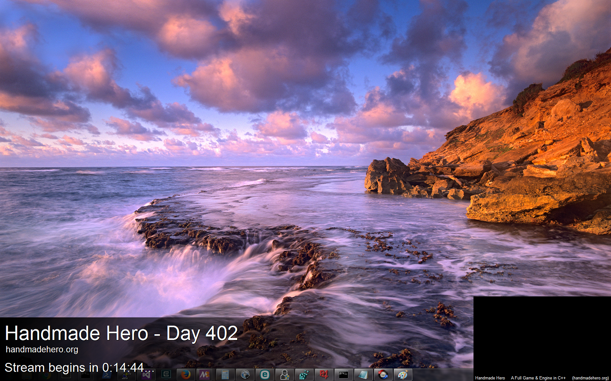
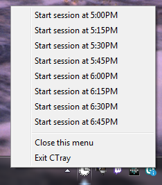

#  ctray - Overlay timer

##  What is it?

A simple program that Casey uses for his [Handmade Hero][linkHandmadeHero] streams.  It's a system tray program that has two overlay windows.  The Countdown overlay, to show the current day and that pops up at given intervals (like 5 minute warning, Q&A begins now, etc).

The second overlay is to help Casey know where the webcam is located.  Due to it being a programming screen, programming behind the webcam can be heard to know what is going on!

When you launch the program, you simple left click on the icon in your system tray, and select the time you wish to start.

##  Message from Casey

   This program is totally hacky.  Don't expect it to work particularly well
   without a fair bit of care and attention.

   It's also super sloppy, like you pass printf arguments in from the settings
   file right now.  So DON'T EXPECT A WELL WRITTEN PROGRAM.  This is not one
   of those.  This is the opposite of that.

   YOU HAVE BEEN WARNED.

   - The Management

##  Installation

TODO(bk):  To be added.

The current project was built on Windows 7, using Visual Studio 2012.

To run `build.bat` it assumes that `vcvarsall.bat` has been run first.

##  Known issues:

*  If you run ctray.exe not from the build directory, it won't be able to find settings.ctray.  In other words, if the working directory is not the build directory, the defaults for the display will be used.  If you begin a session, a new settings.ctray file will be created in the current working directory.
*  That these issues are not in github's issues.

## License

TODO(bk):  To be added.

[linkHandmadeHero]: https://handmadehero.org
